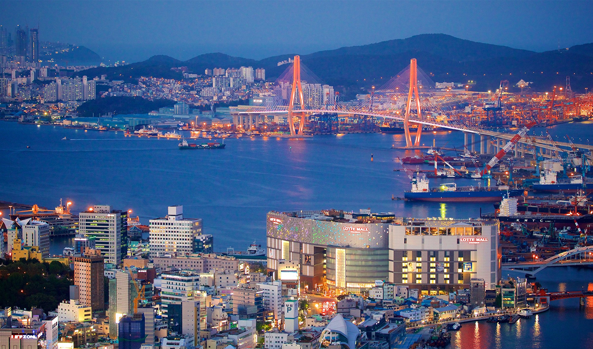

<h1 align="center"> Página de Local Turístico </h1>

Página de turismo em Busan.

  <a href="#-tecnologias">Tecnologias</a>&nbsp;&nbsp;&nbsp;|&nbsp;&nbsp;&nbsp;
  <a href="#-projeto">Projeto</a>&nbsp;&nbsp;&nbsp;|&nbsp;&nbsp;&nbsp;
  <a href="#-layout">Layout</a>&nbsp;&nbsp;&nbsp;|&nbsp;&nbsp;&nbsp;

 

  

## 🚀 Tecnologias

Esse projeto foi desenvolvido com as seguintes tecnologias:

- HTML e CSS
- Git e Github
- Figma

## 💻 Projeto

A Página é um guia para quem for viajar para Busan, mostrando pontos importantes da cidade

## 🔖 Layout

Você pode visualizar o layout do projeto através [DESSE LINK](https://www.figma.com/design/04qU4EPjM4tIyPfe4JRauY/Local-Tur%C3%ADstico--Community-?node-id=0-1&p=f&t=xnabUo4Ky9TJEpdS-0). É necessário ter conta no [Figma](https://figma.com) para acessá-lo.
